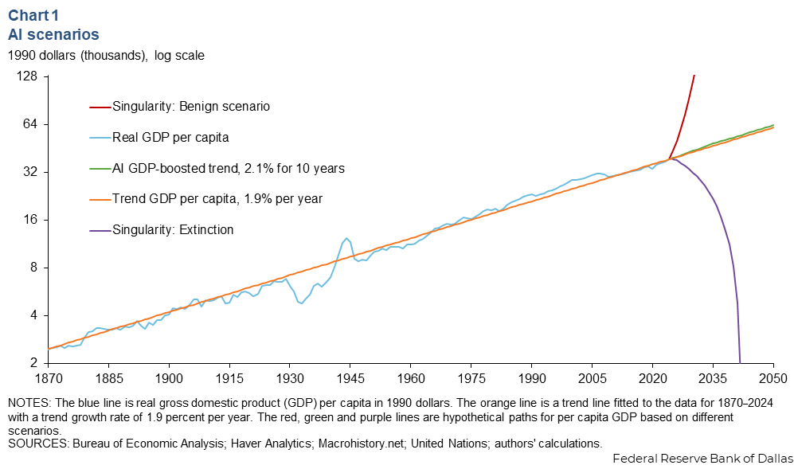

# Jobs-pocalypse now?
### What does the dawn of the AI age mean for your career prospects?

In the roughly three and a half years have passed since ChatGPT launched, the consensus has emerged that its economic impacts will fall somewhere in between the creation of endless abundance and the extinction of humankind.

 ### It's not every day that the Federal Reserve presents "extinction" as a scenario
 
<small>Source: [Dallas Fed (2025)](https://www.dallasfed.org/research/economics/2025/0624)</small>

With each new frontier model release, it becomes harder to doubt that AI will have a significant impact on work and daily life. the timing and direction of that impact is very much up for debate. At first thought it seems sensible to assume that as AI becomes more capable and widely adopted, employment in AI exposed industries will fall in a relatively linear fashion: 
> __AI gets adopted by firms → tasks get automated → workers get replaced → employment goes down__ 

## Measuring AI Exposure

I attempt to extract signal from all the noise (both in the data and the media) by comparing recent employment growth across 197 US industries with different levels of exposure to artificial intelligence.

I make use of [__AI industry exposure (AIIE)__ scores](https://github.com/AIOE-Data/AIOE) calculated by Felten, Raj, and Seamans[^1] by matching AI capabilities (such as language processing and image recognition) to the skills and abilities required in different occupations, then aggregating those occupational scores to create an industry-level exposure measure.

The AIIE scores also do not match perfectly to the industry categories used by the BLS - both due to differences in aggregation and as a result of an update to the North American Industry Classification following the publication of the AIIE scores. As a result, I was only able to match 198 of 249 BLS industries to AIIE scores, giving me about 80% coverage of codes.

## What Does the Data Say?

Despite widespread concerns about automation, highly AI-exposed industries have not experienced consistently weaker employment growth. The estimated relationship between AI exposure and employment growth is slightly positive, but the explanatory power is extremely weak (R2 of c.0.01). Knowing how exposed an industry is to AI tells us almost nothing about how employment in that industry has changed so far.

<iframe src="./assets/emp_growth_ai_anim.html" width="100%" height=800 frameborder="0"></iframe>
<small>Source: AIIE scores mapped onto employment growth rates derived from the US Bureau of Labour Statistics (BLS) Current Employment Statistics (employment levels 1000s, seasonally adjusted).</small>

The most AI-exposed industries are concentrated in the professional and business services and finance sectors, but their employment outcomes variedy widely: `legal services` grew by 4.9% and `insurance agencies and brokerages` grew by 3.1%, while `credit intermediation` fell by about 12% and `computer systems design` fell by 4.5%.

Some of the strongest employment growth is in private education and health services. Several of these have moderate to positive AI exposure scores, but are typically associated with in-person service delivery that is unlikely to be automated away any time soon.

## Why hasn't employment fallen?
This presents a bit of a puzzle: if AI capabilities are improving rapidly and [CEOs are openly discussing AI-driven workforce reductions](https://www.businessinsider.com/list-companies-replacing-human-employees-with-ai-layoffs-workforce-reductions), why don't we see stronger evidence of job losses in the data?

I can think of a few possible explanations, ranging from the practical (limitations in my data/approach) to the theoretical:

### 1. AI is not the only thing happening

The period since ChatGPT's launch has coincided with a number of major shifts in the wider economic environment. Industries have continued to adjust following the Covid-19 pandemic, while changes in trade policy, immigration policy, interest rates, and consumer demand have all affected employment across different sectors. [Many of these factors have direct impacts on the same industries with high AI exposure](https://www.apollo.com/content/dam/apolloaem/images/daily-spark/2026/feb/26/feb26-chart2.jpg).

For example, healthcare, education, construction, manufacturing, and professional services have all been affected by broader economic and policy changes that may have little to do with artificial intelligence. As a result, 

The absence of a strong relationship between AI exposure and employment growth does not necessarily mean AI is having no effect. Instead, any signal from AI adoption may simply be difficult to isolate from everything else happening in the labour market.

### 2. Exposure does not necessarily mean automation
The AIIE scores measure the extent to which an industry's occupations rely on skills that overlap with AI capabilities. They do not directly measure the extent to which tasks have actually been automated or whether firms have adopted AI in practice.

An industry with a high exposure score may contain many tasks that AI can assist with, but that does not necessarily mean we should expect workers to become redundant as a result. AI may alter the way work is performed within an industry without producing noticable changes in industry-level employment. Existing workers may use AI as a complement rather than a substitute to become more productive or shift toward different tasks.

### 3. The J-Curve Effect
The productivity benefits of new technologies are often neither immediate nor automatic. The __["J-curve" theory](https://ide.mit.edu/sites/default/files/publications/2019-04JCurvebrief.final2_.pdf)__[^2] suggests that productivity can initially fall as firms adopt a major new technology as they must invest in new systems, redesign workflows, train workers, and reorganise how work is performed before productivity gains emerge. Picture a letter J that dips down at first before going "to the moon".

If AI follows a similar pattern, highly exposed industries may currently still be working out how to implement it. Firms may even be hiring workers to support AI deployment, integrate new systems, or redesign business processes. 

We could be in the calm before the storm, with the relationship between AI exposure and employment at the industry level appearing weak while the technology diffuses through the economy, with the industry-wide employment effects still to come.

### 4. The Jevons Paradox
A third, more optimistic, possibility is that efficiency gains from AI are offset by increased demand. The __[Jevons paradox](https://www.apollo.com/wealth/insights-news/insights/daily-spark/the-jevons-employment-effect-from-ai)__ is the idea that when a technology makes the production of a good or service cheaper, consumption rises enough to increase overall demand for its inputs (e.g.labour) rather than reduce it.

For example, if AI lowers the cost of producing legal research, financial analysis, software development, or marketing content, firms may choose to produce more of these services rather than maintain output with fewer workers. In this case, productivity improvements could coincide with stable or even rising employment.

Historically, many technological advances have followed this pattern. Jevons initially identified the paradox in 1865 as demand for coal increased as steam engines became more efficient. Torsten Slok at Apollo has compiled a number of more recent examples: [radiologists](https://www.apollo.com/wealth/insights-news/insights/daily-spark/the-radiologist-paradox), [call centres](https://www.apollo.com/wealth/insights-news/insights/daily-spark/ais-most-exposed-industry-keeps-hiring), [travel agents](https://www.apollo.com/wealth/insights-news/insights/daily-spark/cheaper-booking-created-more-demand-for-humans), and [spreadsheet jockeys](https://www.apollo.com/wealth/insights-news/insights/daily-spark/excel-and-jevons-paradox).

If AI is following a similar trajectory, highly exposed industries would be expected to grow, to the benefit of the workers within them.

## Conclusions and next steps
AI exposure alone is not a reliable predictor of employment decline. Measuring AI’s impacts is hard and imperfect, and distinguising these from broader factors like industry demand, macro conditions, and sector-specific shocks would require better data or more sophisticated analysis. For example, an event study ([similar to this one used to assess AI's impact on business formations](https://guillgall.github.io/files/firm_entry_ai.pdf?trk=public_post_comment-text))[^3] would show how AI impacts evolved over time relative to the pre-AI baseline, while also controlling for non-AI confounding factors.

While some highly exposed industries have lost jobs, others have grown, and the overall relationship between exposure and employment growth is weak. This supports the idea that, at least so far, AI is more likely to reshape tasks within industries than produce immediate, uniform job losses across exposed sectors. Incorporating other labour market indicators, such as hours worked or productivity, could help to distinguish between the different directions of impact between industries.

The data does not support the "robots taking all the jobs" narrative. While AI exposure varies substantially across industries, those differences have so far translated into remarkably little variation in employment growth. Whether this reflects a temporary J-curve effect, the start of a Jevons-style demand boom, or simply the early stage of AI adoption remains an open question. What is clear is that, at least for now, your industry's exposure to AI is not a reliable predictor of whether or not you will be automated out of your job.

## References
[^1]: Felten E, Raj M, Seamans R (2021) Occupational, industry, and geographic exposure to artificial intelligence: A novel dataset and its potential uses. Strategic Management Journal 42(12):2195–2217.

[^2]: Brynjolfsson, Erik, Daniel Rock, and Chad Syverson. 2021. "The Productivity J-Curve: How Intangibles Complement General Purpose Technologies." American Economic Journal: Macroeconomics 13 (1): 333–72.

[^3]: Gallacher, Guillermo. 2026 (preliminary). "Firm Entry and AI Exposure: Evidence from US Industries".